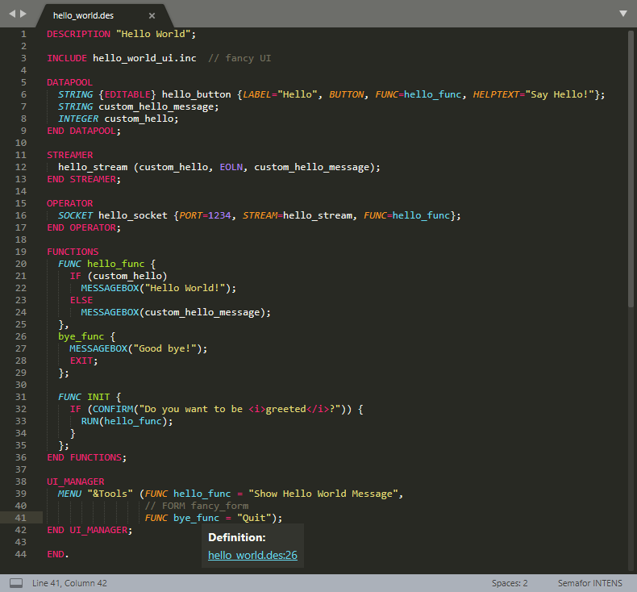

# INTENS Language

This is an unofficial package to provide support for [Sublime Text](https://www.sublimetext.com/) for the so called [INTENS](https://www.semafor.ch/en/products/intens/)&reg; language of the company Semafor AG.

## Call for Sponsorship

This is a **free extension**.
If you find it useful to yourself or your business then you might consider [sponsoring](https://ko-fi.com/anticultist) it.

## Features

* Syntax highlighting
  * INTENS description files
  * INTENS session logs
  * INTENS help files
* Productivity scripts:
  * Add debug-prints to functions
  * Count function references

## Screenshot

