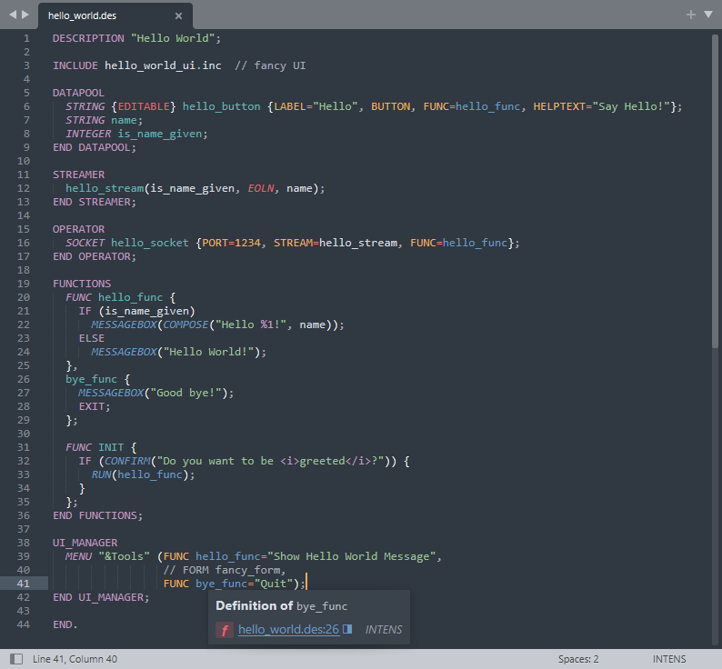

INTENS Language
===============

This is an unofficial package to provide support for [Sublime Text]{https://www.sublimetext.com/} for the so called [INTENS](https://www.semafor.ch/en/products/intens/)&reg; language of the company Semafor AG.

Features
--------
* Syntax highlighting
* Productivity scripts:
  * Add debug-prints to functions
  * Count function usage

Screenshot
----------

